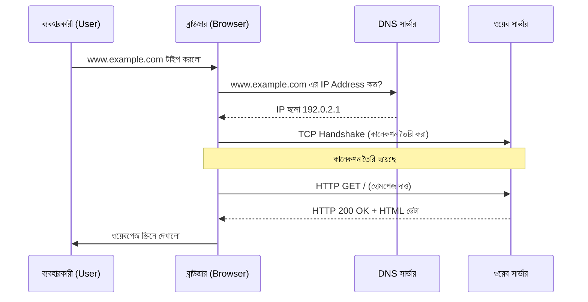

# Web Architecture (ওয়েব আর্কিটেকচার)

## Sequence Diagram of a Web Request (একটি ওয়েব রিকোয়েস্টের সিকোয়েন্স ডায়াগ্রাম)



## TCP/IP Layers Visualization (TCP/IP লেয়ারের চিত্র)
```text
+---------------------+
| Application (HTTP)  | <-- ব্রাউজার এবং সার্ভার এই লেয়ারে কথা বলে
+---------------------+
| Transport (TCP)     | <-- নিশ্চিত করে যে ডেটা ঠিকমতো পৌঁছেছে
+---------------------+
| Network (IP)        | <-- সঠিক IP অ্যাড্রেসে ডেটা পাঠিয়ে দেয়
+---------------------+
| Physical/Link       | <-- আসল ফিজিক্যাল কেবল, রাউটার এবং ওয়াইফাই
+---------------------+
```
